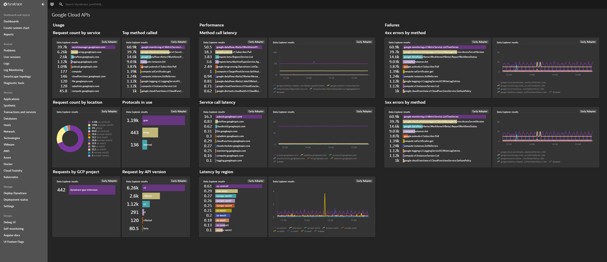
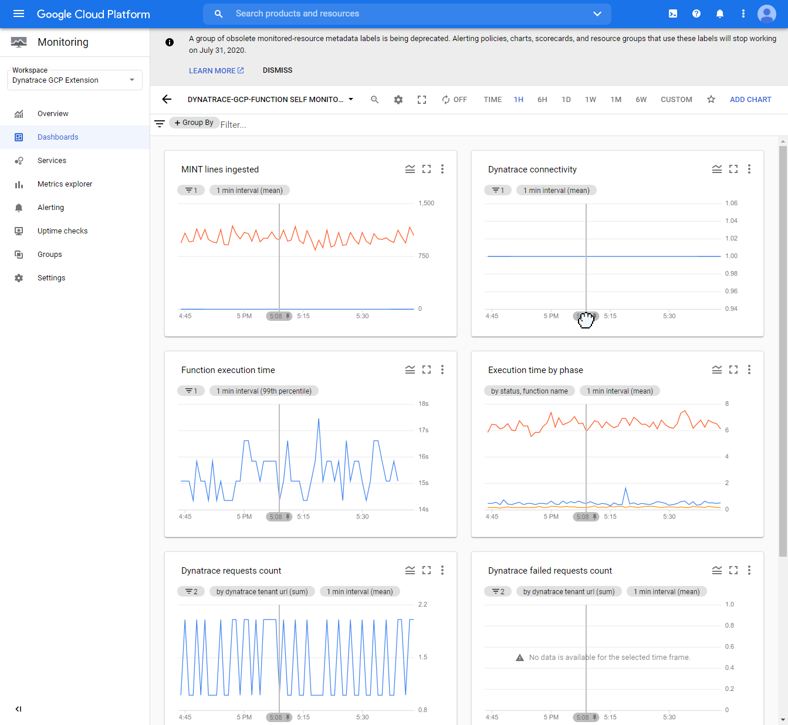

# Dynatrace function for Google Cloud Platform monitoring

This is the home of `dynatrace-gcp-function` which provides the mechanism to pull [Google Cloud metrics](https://cloud.google.com/monitoring/api/metrics_gcp) into Dynatrace.
To help with function deployment you can use automation scripts available in this repo.
Maintaining its lifecycle places a burden on the operational team.


## Overview
`dynatrace-gcp-function` is a [Cloud Function](https://cloud.google.com/functions) written in Python that pulls metrics for configured services from [Cloud Monitoring API](https://cloud.google.com/monitoring/api/v3). Function execution is triggered by [Pub/Sub](https://cloud.google.com/pubsub) upon 1 minute schedule defined in [Cloud Scheduler](https://cloud.google.com/scheduler). Authentication token to query for metrics is retrieved for the scope of [Service account](https://cloud.google.com/iam/docs/service-accounts) that is created during installation process. Once the time series are collected, the values are pushed to [Dynatrace Metrics API v2](https://www.dynatrace.com/support/help/dynatrace-api/environment-api/metric-v2/) using Dynatrace API token and URL to Dynatrace tenant environment stored in [Secret Manager](https://cloud.google.com/secret-manager).

In addition to metrics `dynatrace-gcp-function` is calling Service specific API's (for example Pub/Sub API). The purpose is to get properties of the instances that are not available in Monitoring API.  Particularly the function try to retrieve endpoint addresses (FQDN's, IP addresses).


## Supported Google Cloud services
| Google Cloud service                 | Metric pulling | Pre-defined dashboards | Pre-defined alerts |
| --------------------------  | ---- | ---- | ---- |
| Google Cloud APIs           |  Y   |  Y   |  N   |
| Google Cloud Function       |  Y   |  Y   |  N   |
| Google Cloud SQL            |  Y   |  Y   |  N   | 
| Google Cloud Datastore      |  Y   |  Y   |  N   |
| Google Cloud Filestore      |  Y   |  Y   |  N   |
| Google Cloud Storage        |  Y   |  Y   |  N   |
| Google Cloud Load Balancing |  Y   |  Y   |  N   |
| Google Cloud Pub/Sub        |  Y   |  Y   |  N   |

## Quick start with Google Cloud Shell

### Requirements
Make sure the following dependencies are installed:
* yq [mikefarah/yq GitHub project](https://github.com/mikefarah/yq)

For example, You can use:
```
sudo wget https://github.com/mikefarah/yq/releases/download/3.4.0/yq_linux_amd64 -O /usr/bin/yq && sudo chmod +x /usr/bin/yq
```

`dynatrace-gcp-function` uses Cloud Scheduler that requires App Engine to be created. If you don't have App Engine enabled yet, installer script will prompt you to Create it and select region, where it will run. Reference: [Cloud Scheduler documentation](https://cloud.google.com/scheduler/docs)

### Installation

Download & run the `dynatrace-gcp-function` installation script
```
wget https://raw.githubusercontent.com/dynatrace-oss/dynatrace-gcp-function/master/scripts/setup.sh -O setup.sh ; chmod a+x setup.sh ; ./setup.sh
```

Installation script will prompt for following parameters:
| Parameter   | Description                                   |
| ----------- | --------------------------------------------- |
| GCP project | Google Cloud project, where `dynatrace-gcp-function` should be deployed to. By default, current project set for gcloud CLI. |
| Function size | Amount of memory that should be assigned to the function. Possible options</br> **[s]** - small, up to 500 instances, 256 MB memory allocated to function</br> **[m]** - medium, up to 1000 instances, 512 MB memory allocated to function </br>**[l]** - large, up to 5000 instances, 2048 MB memory allocated to function</br>Please note that You will be able to adjust amount of memory after installation. |
| Dynatrace tenant URI | The URL to Your Dynatrace SaaS or Managed environment |
| Dynatrace API token | Dynatrace API token. You can learn how to generate token [Dynatrace API - Tokens and authentication](https://www.dynatrace.com/support/help/dynatrace-api/basics/dynatrace-api-authentication) manual. Integration requires `API v2 Ingest metrics`, `API v1 Read configuration` and `WriteConfig` Token permission.

## Quick start with Bash
### Requirements
Make sure the following dependencies are installed:
* jq
* yq [mikefarah/yq GitHub project](https://github.com/mikefarah/yq)
* Google Cloud SDK [Google Cloud SDK installer](https://cloud.google.com/sdk/docs/downloads-interactive#linux)

For example, on Ubuntu You can use:
```
sudo wget https://github.com/mikefarah/yq/releases/download/3.4.0/yq_linux_amd64 -O /usr/bin/yq && sudo chmod +x /usr/bin/yq
sudo apt-get install jq
curl https://sdk.cloud.google.com | bash
```

Restart the console and initialize Cloud SDK ([Initializing Cloud SDK](https://cloud.google.com/sdk/docs/initializing)):
```
gcloud init
```

### Install `dynatrace-gcp-function`

Run the `dynatrace-gcp-function` installation script:
```
wget https://raw.githubusercontent.com/dynatrace-oss/dynatrace-gcp-function/master/scripts/setup.sh -O setup.sh ; chmod a+x setup.sh ; ./setup.sh
```

Installation script will prompt for following parameters:
| Parameter   | Description                                   |
| ----------- | --------------------------------------------- |
| GCP project | Google Cloud project, where `dynatrace-gcp-function` should be deployed to. By default, current project set for gcloud CLI. |
| Function size | Amount of memory that should be assigned to the function. Possible options</br> **[s]** - small, up to 500 instances, 256 MB memory allocated to function</br> **[m]** - medium, up to 1000 instances, 512 MB memory allocated to function </br>**[l]** - large, up to 5000 instances, 2048 MB memory allocated to function</br>Please note that You will be able to adjust amount of memory after installation. |
| Dynatrace tenant URI | The URL to Your Dynatrace SaaS or Managed environment |
| Dynatrace API token | Dynatrace API token. You can learn how to generate token [Dynatrace API - Tokens and authentication](https://www.dynatrace.com/support/help/dynatrace-api/basics/dynatrace-api-authentication) manual. Integration requires `Ingest metrics using API V2` Token permission.

**Please note** `dynatrace-gcp-function` uses Cloud Scheduler that requires App Engine to be created. If you don't have App Engine enabled yet, installer script will prompt you to Create it and select region, where it will run. Reference: [Cloud Scheduler documentation](https://cloud.google.com/scheduler/docs)

## Quick start on Kubernetes
### Requirements 
* Google Cloud SDK [Google Cloud SDK installer](https://cloud.google.com/sdk/docs/downloads-interactive#linux)
* Kubernetes CLI [Install and setup kubectl](https://kubernetes.io/docs/tasks/tools/install-kubectl/) 

### Create Service Account & Kubernetes objects
Create `dynatrace` namespace with `kubectl`, and secrets for Dynatrace cluster `API token` and `URL`. 

Replace {DYNATRACE_URL} with URL to Your Dynatrace SaaS or Managed environment.

Replace {DYNATRACE_API_TOKEN} with  Dynatrace API token. You can learn how to generate token [Dynatrace API - Tokens and authentication](https://www.dynatrace.com/support/help/dynatrace-api/basics/dynatrace-api-authentication) manual. Integration requires `Ingest metrics using API V2` Token permission.
```
kubectl create namespace dynatrace
kubectl -n dynatrace create secret generic dynatrace-gcp-function-secret --from-literal="access-key={DYNATRACE_API_TOKEN}" --from-literal="url={DYNATRACE_URL}"
```

Create IAM Service Account with Cloud Shell. Replace `{GCP-PROJECT-ID}` with your GCP project ID

```
gcloud iam service-accounts add-iam-policy-binding --role roles/iam.workloadIdentityUser --member "serviceAccount:{GCP-PROJECT-ID}.svc.id.goog[dynatrace/dynatrace-gcp-function-sa]" dynatrace-gcp-function-sa@{GCP-PROJECT-ID}.iam.gserviceaccount.com
```

Grant required IAM policies to Service Account. Replace `{GCP-PROJECT-ID}` with your GCP project ID
```
gcloud projects add-iam-policy-binding {GCP-PROJECT-ID} --member="serviceAccount:dynatrace-gcp-function-sa@{GCP-PROJECT-ID}.iam.gserviceaccount.com" --role=roles/monitoring.editor
gcloud projects add-iam-policy-binding {GCP-PROJECT-ID} --member="serviceAccount:dynatrace-gcp-function-sa@{GCP-PROJECT-ID}.iam.gserviceaccount.com" --role=roles/monitoring.viewer
gcloud projects add-iam-policy-binding {GCP-PROJECT-ID} --member="serviceAccount:dynatrace-gcp-function-sa@{GCP-PROJECT-ID}.iam.gserviceaccount.com" --role=roles/compute.viewer
gcloud projects add-iam-policy-binding {GCP-PROJECT-ID} --member="serviceAccount:dynatrace-gcp-function-sa@{GCP-PROJECT-ID}.iam.gserviceaccount.com" --role=roles/cloudsql.viewer
gcloud projects add-iam-policy-binding {GCP-PROJECT-ID} --member="serviceAccount:dynatrace-gcp-function-sa@{GCP-PROJECT-ID}.iam.gserviceaccount.com" --role=roles/cloudfunctions.viewer
gcloud projects add-iam-policy-binding {GCP-PROJECT-ID} --member="serviceAccount:dynatrace-gcp-function-sa@{GCP-PROJECT-ID}.iam.gserviceaccount.com" --role=roles/file.viewer
gcloud projects add-iam-policy-binding {GCP-PROJECT-ID} --member="serviceAccount:dynatrace-gcp-function-sa@{GCP-PROJECT-ID}.iam.gserviceaccount.com" --role=roles/pubsub.viewer
```

Download and install [dynatrace-gcp-function.yaml](k8s/dynatrace-gcp-function.yaml) Kubernetes objects:
```
wget https://raw.githubusercontent.com/dynatrace-oss/dynatrace-gcp-function/master/k8s/dynatrace-gcp-function.yaml
```
You can adjust the function behavior in `dynatrace-gcp-function-config` Config Map defined in dynatrace-gcp-function.yaml. 

Deploy Kubernetes objects:
```
kubectl apply -f dynatrace-gcp-function.yaml
```

Create annotation for service account. Replace `{GCP-PROJECT-ID}` with your GCP project ID:
```
kubectl annotate serviceaccount --namespace dynatrace dynatrace-gcp-function-sa iam.gke.io/gcp-service-account=dynatrace-gcp-function-sa@{GCP-PROJECT-ID}.iam.gserviceaccount.com
```

Check the container status:
```
kubectl -n dynatrace logs -l app=dynatrace-gcp-function
```
Logs should output overall status of each metrics pull execution:
```
Starting download of metadata for service 'cloudsql_database'
Download of metadata for service 'pubsub_subscription' finished
Download of metadata for service 'cloudsql_database' finished
Download of metadata for service 'filestore_instance' finished
Download of metadata for service 'cloud_function' finished
Fetched GCP data in 1.1237902641296387 s
Ingest response: {'linesOk': 421, 'linesInvalid': 0, 'error': None}
Finished uploading metric ingest lines to Dynatrace in 0.36574411392211914 s
Pushing self monitoring time series to GCP Monitor...
Finished pushing self monitoring time series to GCP Monitor
```

## Monitoring GCP instances in Dynatrace

Installation script deploys Dynatrace Dashboards for GCP services within provided Dynatrace tenant. You can browse them in Dynatrace UI.

Dashboards list:


Sample dashboard for GCP API:



## Monitoring and troubleshooting `dynatrace-gcp-function`

`dynatrace-gcp-function` reports self-monitoring metrics as Google Metrics. This allow to track eventual problems with communication between the function and Dynatrace cluster. 

Self monitoring metrics:
| Metrics | Description |
| ------- | ----------- |
| MINT lines ingested | Amount of lines of metrics (data points) ingested into Dynatrace Metric INTerface for given interval. |
| Dynatrace connectivity | Status (1 -ok) indicating the connectivity between monitoring function and Dynatrace cluster. Connectivity can be broken due to wrong Dynatrace URL provided, wrong API token or network connectivity issues |
| Dynatrace failed requests count | Amount of requests that were rejected by Dynatrace Metric INTerface. The reason for failure can be unexpected data point value or reaching request quota for metric ingest |
| Dynatrace requests count | Amount of requests that were send to Dynatrace cluster.  |

Installation script deploy `dynatrace-gcp-function Self Monitoring` dashboard upon installation process to help tracking health of the solution.




## Contributing

See [CONTRIBUTING](CONTRIBUTING.md) for details on submitting changes.

## License

`dynatrace-gcp-function` is under Apache 2.0 license. See [LICENSE](LICENSE) for details.