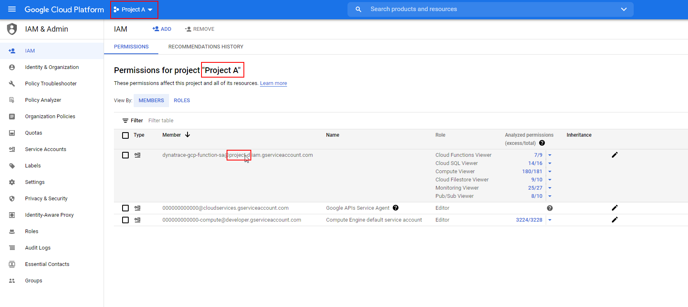

- @TODO: Linking to Dynatrace documentation


# Dynatrace function for Google Cloud Platform monitoring

This is the home of `dynatrace-gcp-function` which provides the mechanism to pull all [Google Cloud metrics](https://cloud.google.com/monitoring/api/metrics_gcp) into Dynatrace. 
To help with deployment you can use automation scripts available in this repo.
Maintaining its lifecycle places a burden on the operational team.


## Getting started
There are two deployment options available, you can:
- [run it on Google Kubernetes Engine](docs/k8s/getting_started.md) or 
- [deploy a Google Cloud Function](docs/function/getting_started.md)


## Pricing
Metrics will consume DDUs for more details [refer to documention](https://dynatrace.com)

## Monitoring multiple GCP projects
It's possible to deploy `dynatrace-gcp-function` to push metrics to Dynatrace from multiple GCP projects. 

For example: it's possible to run function in project dedicated for monitoring and get metrics from production/stage/dev projects. The concept is illustrated on the diagram below:

*Sample multi-project deployment*


To configure multi-project support in this example You will need:
* Running `dynatrace-gcp-function` (Cloud Function or Kubernetes)
* IAM service account configured with `dynatrace-gcp-function` (for example `dynatrace-gcp-function-sa@{GCP-FUNCTION-PROJECT-ID}.iam.gserviceaccount.com`)

Now You need to grant required IAM policies to Service Account for desired projects (for example `PROJECT-A`, `PROJECT-B`, `PROJECT-C`). 

Replace `{GCP-PROJECT-ID-TO-MONITOR}` with the project You wish to enable monitoring for. Replace `{GCP-FUNCTION-PROJECT-ID}` with the project the Service Account is created on / function is deployed. Repeat the step for all projects.
```
gcloud projects add-iam-policy-binding {GCP-PROJECT-ID-TO-MONITOR} --member="serviceAccount:dynatrace-gcp-function-sa@{GCP-FUNCTION-PROJECT-ID}.iam.gserviceaccount.com" --role=roles/monitoring.editor
gcloud projects add-iam-policy-binding {GCP-PROJECT-ID-TO-MONITOR} --member="serviceAccount:dynatrace-gcp-function-sa@{GCP-FUNCTION-PROJECT-ID}.iam.gserviceaccount.com" --role=roles/monitoring.viewer
gcloud projects add-iam-policy-binding {GCP-PROJECT-ID-TO-MONITOR} --member="serviceAccount:dynatrace-gcp-function-sa@{GCP-FUNCTION-PROJECT-ID}.iam.gserviceaccount.com" --role=roles/compute.viewer
gcloud projects add-iam-policy-binding {GCP-PROJECT-ID-TO-MONITOR} --member="serviceAccount:dynatrace-gcp-function-sa@{GCP-FUNCTION-PROJECT-ID}.iam.gserviceaccount.com" --role=roles/cloudsql.viewer
gcloud projects add-iam-policy-binding {GCP-PROJECT-ID-TO-MONITOR} --member="serviceAccount:dynatrace-gcp-function-sa@{GCP-FUNCTION-PROJECT-ID}.iam.gserviceaccount.com" --role=roles/cloudfunctions.viewer
gcloud projects add-iam-policy-binding {GCP-PROJECT-ID-TO-MONITOR} --member="serviceAccount:dynatrace-gcp-function-sa@{GCP-FUNCTION-PROJECT-ID}.iam.gserviceaccount.com" --role=roles/file.viewer
gcloud projects add-iam-policy-binding {GCP-PROJECT-ID-TO-MONITOR} --member="serviceAccount:dynatrace-gcp-function-sa@{GCP-FUNCTION-PROJECT-ID}.iam.gserviceaccount.com" --role=roles/pubsub.viewer
```

After next monitoring run (~1 minute) metrics from configured projects should start appearing in Dynatrace.

Alternatively You may grant access for all projects in `IAM & Admin` console in Google Cloud Portal. Simply navigate to all of the projects and add permissions for Service Account attached to function:




## Monitoring Google Cloud Platform using Dashboards in Dynatrace

Installation script deploys Dynatrace Dashboards for GCP services within provided Dynatrace tenant. Following services will get out-of-the-box dashboards: 
- Google Cloud APIs
- Google Cloud Function
- Google Cloud SQL
- Google Cloud Datastore
- Google Cloud Filestore
- Google Cloud Storage  
- Google Cloud Load Balancing
- Google Cloud Pub/Sub
- Google Kubernetes Node
- Google Kubernetes Container
- Google Kubernetes Cluster

**Feel free to contribute.** Simply create a dashboard in Dynatrace, export it as json and create a PR with configuration added to `src/dashboards` (make sure that the dashboard filename is equal to service configuration filename `src/config`)

Imported dashboards can be found in Dynatrace UI under Dashboards list:


Sample dashboard for Google Cloud API:


## Self-monitoring

`dynatrace-gcp-function` reports self-monitoring metrics as Google Metrics. This allow to track eventual problems with communication between the function and Dynatrace cluster. 

Self monitoring metrics:
| Metrics | Description |
| ------- | ----------- |
| MINT lines ingested | Amount of lines of metrics (data points) ingested into Dynatrace Metric INTerface for given interval. |
| Dynatrace connectivity | Status (1 -ok) indicating the connectivity between monitoring function and Dynatrace cluster. Connectivity can be broken due to wrong Dynatrace URL provided, wrong API token or network connectivity issues |
| Dynatrace failed requests count | Amount of requests that were rejected by Dynatrace Metric INTerface. The reason for failure can be unexpected data point value or reaching request quota for metric ingest |
| Dynatrace requests count | Amount of requests that were send to Dynatrace cluster.  |

Installation script deploy `dynatrace-gcp-function Self Monitoring` dashboard upon installation process to help tracking health of the solution.


## Support
Before you create a ticket check troubshooting guides specific to your deployment.  
If you didn't find a solution please [contact Dynatrace support](https://www.dynatrace.com/support/contact-support/). 


## Contributing

See [CONTRIBUTING](CONTRIBUTING.md) for details on submitting changes.

## License

`dynatrace-gcp-function` is under Apache 2.0 license. See [LICENSE](LICENSE.md) for details.
