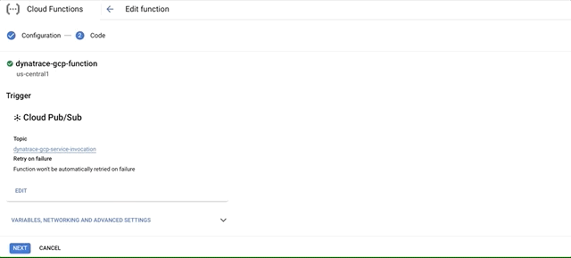

- @TODO animation for uncomment services

### Overview
`dynatrace-gcp-function` is a [Cloud Function](https://cloud.google.com/functions) written in Python that pulls metrics for configured services from [Cloud Monitoring API](https://cloud.google.com/monitoring/api/v3). Function execution is triggered by [Pub/Sub](https://cloud.google.com/pubsub) upon 1 minute schedule defined in [Cloud Scheduler](https://cloud.google.com/scheduler). Authentication token to query for metrics is retrieved for the scope of [Service account](https://cloud.google.com/iam/docs/service-accounts) that is created during installation process. Once the time series are collected, the values are pushed to [Dynatrace Metrics API v2](https://www.dynatrace.com/support/help/dynatrace-api/environment-api/metric-v2/) using Dynatrace API token and URL to Dynatrace tenant environment stored in [Secret Manager](https://cloud.google.com/secret-manager).


## Getting started

There are two quick start options you can choose from:
- [using Google Cloud Shell](./start-with-google-cloud-shell.md) or
- [using Bash](./start-with-bash.md)


**Please note** `dynatrace-gcp-function` uses Cloud Scheduler that requires App Engine to be created. If you don't have App Engine enabled yet, installer script will prompt you to Create it and select region, where it will run. Reference: [Cloud Scheduler documentation](https://cloud.google.com/scheduler/docs)


### Extend monitoring scope

1. Download and modify configuration file
```
wget https://raw.githubusercontent.com/dynatrace-oss/dynatrace-gcp-function/master/activation-config.yaml
```

2. Uncomment services you want to monitor under `activation.metrics.services` section

<< animation? >>

3. Download & run the `dynatrace-gcp-function` installation script in the same folder as your `activation-config.yaml` file is
```
wget https://raw.githubusercontent.com/dynatrace-oss/dynatrace-gcp-function/master/scripts/setup.sh -O setup.sh ; chmod a+x setup.sh ; ./setup.sh
```

*Alternatively, you can change the `GCP_SERVICES` runtime environment variable and deploy it.*




### Troubleshoot and support
#### I can not see metrics in Dynatrace
To start troubleshooting please check `dynatrace-gcp-function` logs in Logs Explorer. Search for any connectivity issues or permissions problems. If there are problems with permissions make sure that Dynatrace Token has the right scopes. To change the Token reinstall `dynatrace-gcp-function`

---

If you didn't find a solution please [contact Dynatrace support](https://www.dynatrace.com/support/contact-support/). 